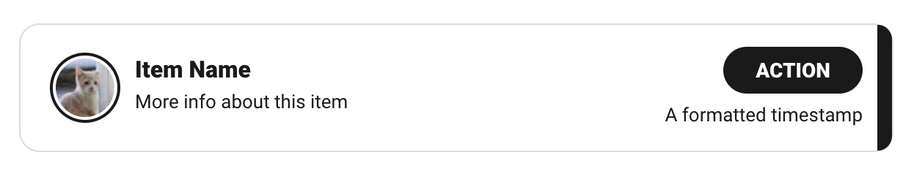
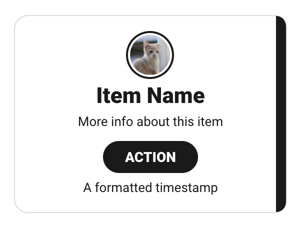

# Starting The App
TODO: test this procedure
```
cd react-project
npm ci
npm start
```

# Goal

Write a React application that consumes any public API. The objective is to
build an app that displays data from the API and supports pagination to display
more data. Provided are some card/item designs to loosely base the mobile and
desktop layouts off of.

#### Desktop Card Example



#### Mobile Card Example



Feel free to use a public api of your choice, but this might be a good place to
start if you are stuck: https://github.com/public-apis/public-apis#music.

## Expectations

Try to time-box the exercise at around ~ 3 hours. Keep this constraint in mind
as you work, it's very possible that certain items don't get finished, try to
save a few minutes to summarize your efforts in a readme or email if this is the
case.

## Requirements

- Display data in a list using React
- Should be able to paginate/infinite scroll to get at more results
- Use provided images as an example for what an item in the list might look
  like, but take liberties with the provided designs as they are not set in
  stone
- Improvise the layout of the page surrounding the cards and be as creative as
  you like
- Create both mobile and desktop layouts
- The entire card should be clickable to go to another page (can click to
  google.com and does not need to be a detail/show page associated with the API)
- The card should also have a button within it that triggers a separate action
  (can launch a browser confirm/alert)
- Add your own flair for things like hover states and colors that are used
- Provide documentation or instructions on how to run the application
- Limit 3rd party libraries to only "must haves"

## Evaluation

The qualities we're looking for are:

- **Clarity**: is the code organized and structured well, is it easy to read and comprehend?
- **Maintainability**: if it had to be updated / extended how easy would that be?

## Questions

If you have questions about the instructions, please ask. We want you to be
successful. If you have a question about how to handle something that wasn't
specifically addressed, make a decision and feel free to call it out in your
readme or email with your reasoning behind your decision. No right or wrong
answers for these types of things.
